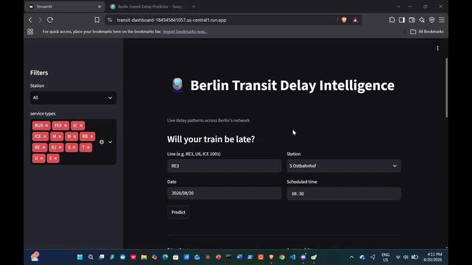
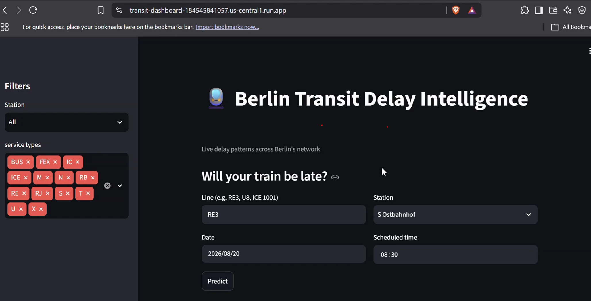
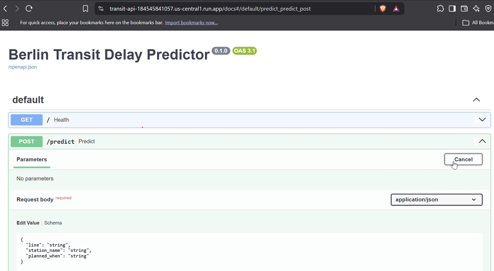

# Berlin Transit Delay Intelligence

**Keeping a model honest on data that never stops moving.**

An end-to-end data & ML engineering pipeline that predicts one thing — *will this Berlin train be more than 3 minutes late?* — from live data collection all the way to a deployed public API, dashboard, and full observability. Built to mirror the stack of Berlin scale-ups: every tool maps to a real production concern, and every major decision is written down in a plain-language log.

[](https://github.com/kai2055/berlin-transit/actions/workflows/ci.yml)


-brightgreen)


🔗 **[Live API](https://transit-api-184545841057.us-central1.run.app)** &nbsp;·&nbsp; **[Live dashboard](https://transit-dashboard-184545841057.us-central1.run.app)**



**Live dashboard — charts, filters, and the delay predictor:**



**The predictor — will this train be more than 3 minutes late?**


-->

---

## What it shows

- 🔁 The first model tried to predict exact delay in seconds and **lost to a "just guess zero" baseline** (MAE ~45s) — reframed as binary classification, **XGBoost, ROC-AUC 0.886**
- 🚆 **Service type** (U-Bahn vs. RE vs. ICE) drives lateness more than station or time of day — a more useful finding than the raw accuracy number
- 💶 The whole system runs inside **GCP's always-free tier at effectively €0**, with a €1 budget alert as a tripwire

---

## What it does

Every ~10 minutes, a collector polls live departure data for **12 Berlin/Brandenburg (VBB) stations** and banks the raw JSON. That data flows through storage, transformation, and modeling layers, ending in a model served over a public API and explored through a live dashboard.

---

## The stack

Grouped by what each layer does — everything single-cloud GCP.

| Layer | Tools |
| --- | --- |
| **Collection** | GitHub Actions (scheduled git-scraper), Python |
| **Storage** | Google Cloud Storage (raw vault), BigQuery (warehouse, ELT) |
| **Transformation** | dbt (staging → intermediate → mart, with tests), PySpark (lake-ETL) |
| **Modeling** | scikit-learn, XGBoost, MLflow (experiment tracking) |
| **Serving** | FastAPI, Docker, Cloud Run (public API) |
| **Dashboard** | Streamlit on Cloud Run (charts, filters, live predictor) |
| **Orchestration** | Cloud Run job + Cloud Scheduler (repo → GCS → BigQuery sync) |
| **Observability** | Prometheus, Pushgateway, Grafana |
| **Infrastructure** | Terraform (service account, IAM, Cloud Run job, scheduler as code) |
| **Kubernetes** | kind (local cluster: Deployment, Service, health probes) |
| **CI** | GitHub Actions (ruff linting on every push) |

---

## Engineering decisions worth calling out

The judgment calls — including the honest failures, documented rather than hidden.

- **Regression lost to the baseline, so the problem was reframed.** Predicting exact delay in seconds failed to beat "just guess zero" (MAE ~45s). Rather than force it, the problem became binary classification — *"more than 3 minutes late?"* — with XGBoost + `scale_pos_weight` for the class imbalance, reaching ROC-AUC 0.886. **The failed regression is kept in the repo as part of the story.**
- **Time-series "duplicates" are real data, not defects.** A uniqueness test on trip IDs failed because the same train is legitimately captured across multiple polls as its delay evolves. Instead of masking it with a compound key, the data is modeled as it truly is and deduplicated to the final delay per trip. *(ADR-0006, ADR-0007)*
- **Batch jobs need Pushgateway, not direct scraping.** Prometheus pulls from always-on services, but the sync job runs briefly and exits — nothing to scrape. It pushes all-Gauge metrics to a Pushgateway on exit instead (Pushgateway is last-write-wins, so counters can't accumulate). *(ADR-0013)*
- **Kubernetes is a demonstration, not a need.** The app already runs on Cloud Run; `kind` proves the Kubernetes skill (Deployment, Service, probes) locally and for free, rather than paying for GKE nodes the project doesn't require. *(ADR-0014)*

---

## Repo layout

```
collect.py          # Phase-0 collector (deliberately simple baseline)
orchestration/      # sync.py: repo -> GCS -> BigQuery (Cloud Run job)
transit/            # dbt project (staging, intermediate, mart models + tests)
ml/                 # feature building, training, MLflow tracking
serving/            # FastAPI app + Dockerfile + Kubernetes manifests
dashboard/          # Streamlit dashboard
spark/              # PySpark lake-ETL job
observability/      # Prometheus + Pushgateway + Grafana (docker-compose)
terraform/          # infrastructure as code
decisions/          # 14 ADRs — every major decision, in plain language
.github/workflows/  # CI (ruff linting)
```

---

## Running it yourself

The live services need nothing — just open the URLs above. To run pieces locally:

```bash
# Observability stack (Grafana :3000, Prometheus :9090, Pushgateway :9091)
cd observability && docker compose up -d

# API on Kubernetes
kind create cluster --name transit
kind load docker-image transit-api:local --name transit
kubectl apply -f serving/

# Lint
ruff check .
```

A payment card is required for GCP, but the project stays inside the always-free tier (GCS 5 GB, BigQuery 10 GB storage + 1 TB queries/month). A €1 budget alert acts as a tripwire.

---

## Decision log

Every architectural choice — including the ones that changed course — is recorded in [`decisions/`](decisions/) as a short, plain-language ADR. Fourteen so far, covering the cloud choice, the ELT approach, the regression-to-classification reframe, the observability pattern, the Kubernetes decision, and more.
